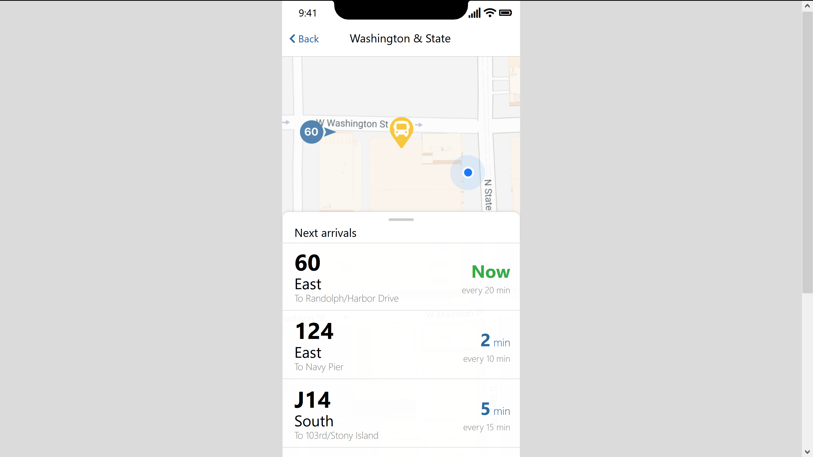

<h1>BusyBus Frontend Challenge</h1>
<h3>Bobbie Ysabel Benedito</h3>
<h3>11/16/2018</h3>

This project is a bus stop screen for the BusyBus mobile application. I built this during my apprenticeship in the Designer Track at [Bloc](https://bloc.io). 

BusyBus is operated by a local urban transit system and serves thousands of commuters in a large city. Due to rapid expansion, the bus stop at Washington & State now serves seven bus lines. Riders are complaining that they have no way of knowing which bus is coming and when.

For this project I had to do research on the public transit app market and survey users to see what they need from a public transit app such as BusyBus. I then mocked up a visual design for the Washington & State bus stop screen in Figma, developed the screen in HTML/CSS, and deployed it to GitHub Pages.

[UX Research Challenge Summary](https://drive.google.com/open?id=1kvPBp2rCWPATqdwXaWD2aZIftUUcMx5E)  
[Visual Challenge Summary](https://drive.google.com/open?id=1oVu4u7pvgQD45_l_bF0uz80UAuLWzGpF)  
[Visual Design on Figma](https://www.figma.com/proto/xNKhbi2zvPhpcBLAi4dKEW/BusyBus?node-id=40795%3A4647&scaling=scale-down)  
[Final Screen on GitHub Pages](https://bobbiebenedito.github.io/busybus/)  

<h4>Major challenges in building the frontend:</h4>

1. **Correctly positioning the bus list drawer over the map.** I initially had `#bus-list` in a fixed position at the bottom of the screen. This made it look correct in the browser. However, when I checked it on mobile at different screen sizes, the positioning was incorrect. I solved this by using the position property and setting `#bus-list` to have an `position: absolute` and #map to have a `position: relative`. This moved the two divs to stay in the correct location on the page. I also used the `z-index` property to ensure that the map remained under the bus-list.

2. **Positioning bus and arrival info in the center of the list item box.** I struggled to vertically center the `.bus-info` and `.arrival-info` divs inside the `.bus` div the way they were in my design. Because the `.arrival-info` divs for the different list items were different sizes depending on what time the bus was arriving, setting the padding wouldn’t work uniformly. I used the position property to place the top of the info divs at 50% relative to the list item boxes. Then I used the transform property to translate the info divs up the y-axis so that that they would be vertically centered in the box.

3. **Adjusting the background of the bus list items.** In my original design, the background for the bus list items was white, slightly transparent, and blurred. I found it challenging to implement this in the code. It’s easy to add a `background-color` to the `.bus` div. However, using filters to blur and change the opacity affected the text as well, not just the background. I solved this issue by creating a separate `.bus-background` div to go behind `.bus`. For the `.bus-background` divs I applied a `background-color: #ffffff` and `filter: opacity(95%)` to change the opacity. I was unable to implement the blur filter because it went beyond the bounds of the div, making the screen look messy. 

4. **Emulating mobile drawer behavior.** To more realistically emulate a mobile drawer's scrolling behavior, I placed the `#next-arrivals` item and its background divs in a separate `#top-wrapper` container and moved that container to the parent element so it'd be separate from the rest of the bus list. I then used `position: sticky` so it would scroll up and sticky at the top of the page while the rest of the bus list scrolls.
